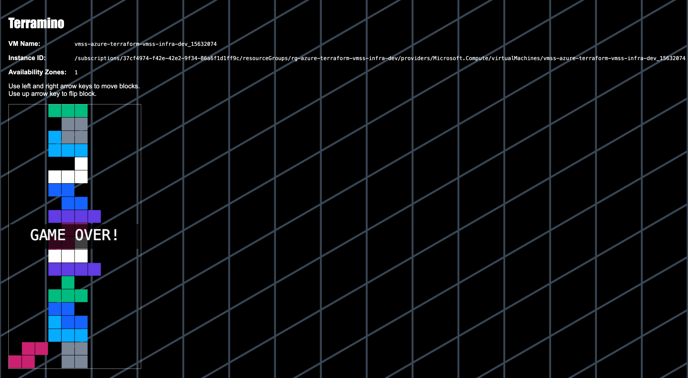

# 🚀 Azure Terraform VMSS Infrastructure

## 📌 Project Overview

This project demonstrates a **production-style Azure infrastructure** built using **Terraform**, following modular and scalable design principles.

The infrastructure includes:

* Virtual Network (VNet)
* Subnets (Application & Management)
* Network Security Groups (NSG)
* Azure Load Balancer
* Virtual Machine Scale Set (VMSS)
* Autoscaling based on CPU metrics
* NAT Gateway for outbound traffic
* Remote backend using Azure Storage Account

---

## 🏗️ Architecture

```text
Internet
   ↓
Public IP (DNS)
   ↓
Load Balancer
   ↓
NSG (Security Layer)
   ↓
VM Scale Set (Multiple VMs)
   ↓
NAT Gateway (Outbound)
   ↓
Internet
```

---

## 📸 Output (Load Balancing Demo)


👉 Refreshing the page shows different VM instances, proving:

* Load balancing is working
* Multiple instances are active

---

## 📁 Project Structure

```bash
azure-terraform-vmss-infra/
├── 10-network/
├── 20-security/
├── 30-loadbalancer/
├── 40-compute/
├── 50-autoscaling/
├── az-remote-backend-config/
```

---

## 🧠 Module Breakdown

### 🔹 10-network

* Resource Group
* Virtual Network
* Application Subnet
* Management Subnet

---

### 🔹 20-security

* Network Security Group (NSG)
* Dynamic rules:

    * Allow HTTP from Internet → Load Balancer
    * Allow traffic from Load Balancer → VMSS
    * Deny all other traffic

---

### 🔹 30-loadbalancer

* Public IP
* Load Balancer
* Backend Pool
* Health Probe (Port 80)
* Load balancing rules

---

### 🔹 40-compute

* Virtual Machine Scale Set (VMSS)
* Ubuntu 22.04
* Auto-configured using `user-data.sh`
* Connected to Load Balancer backend pool

---

### 🔹 50-autoscaling

* Auto scale-out when CPU > 80%
* Auto scale-in when CPU < 10%
* Min instances: 2
* Max instances: 5

---

### 🔹 az-remote-backend-config

Creates Terraform remote backend resources:

```hcl
resource "azurerm_resource_group" "rg" {
  name     = local.resource_group_name
  location = var.location
  tags     = local.common_tags
}

resource "azurerm_storage_account" "storage" {
  name                     = local.storage_account_name
  resource_group_name      = azurerm_resource_group.rg.name
  location                 = azurerm_resource_group.rg.location
  account_tier             = "Standard"
  account_replication_type = "LRS"

  lifecycle {
    prevent_destroy = true
  }

  tags = merge(
    local.common_tags,
    {
      Name = local.storage_name_tag
    }
  )
}

resource "azurerm_storage_container" "container" {
  name                  = local.container_name
  storage_account_id    = azurerm_storage_account.storage.id
  container_access_type = "private"
}
```

---

## 🔐 Remote Backend Configuration

Each module uses Azure Storage as backend:

```hcl
backend "azurerm" {
  resource_group_name  = "rg-tfstate-learndev-dev"
  storage_account_name = "tfstatelearndevdev"
  container_name       = "tfstate"
  key                  = "vmss/dev/<module>/terraform.tfstate"
}
```

---

## 🚀 How to Deploy

### 1️⃣ Initialize backend

```bash
cd az-remote-backend-config
terraform init
terraform apply
```

---

### 2️⃣ Deploy modules (in order)

```bash
cd 10-network && terraform init && terraform apply
cd ../20-security && terraform init && terraform apply
cd ../30-loadbalancer && terraform init && terraform apply
cd ../40-compute && terraform init && terraform apply
cd ../50-autoscaling && terraform init && terraform apply
```

---

## 🌐 Access Application

```text
http://<load-balancer-dns>
```

---

## 🧪 Validation

* Refresh browser → different VM names
* Confirms:

    * Load balancing ✅
    * VMSS working ✅
    * Scaling ready ✅

---

## 🧠 Key Concepts

| Concept       | Description              |
| ------------- | ------------------------ |
| VNet          | Private network in Azure |
| Subnet        | Logical segmentation     |
| NSG           | Firewall rules           |
| Load Balancer | Traffic distribution     |
| VMSS          | Auto-scaling VMs         |
| NAT Gateway   | Outbound internet access |
| Remote State  | Shared Terraform state   |

---

## 🐞 Challenges & Fixes

| Issue                | Fix                   |
| -------------------- | --------------------- |
| NSG blocking traffic | Allowed Internet → LB |
| HTTPS not working    | Used HTTP (port 80)   |
| VM size unavailable  | Changed SKU           |
| Apache default page  | Removed index.html    |
| JSON instead of UI   | Prioritized index.php |

---

## 💡 Interview Explanation

> I designed a modular Azure infrastructure using Terraform where traffic is routed through a Load Balancer to a VM Scale Set. The system is secured using NSGs, configured using startup scripts, and supports autoscaling based on CPU usage.

---

## 🏆 Outcome

* Scalable infrastructure
* Secure networking
* Automated provisioning
* Production-ready architecture

---

## 📌 Future Improvements

* Add HTTPS with Application Gateway
* Integrate CI/CD (Azure DevOps)
* Use Key Vault for secrets
* Multi-region deployment

---
